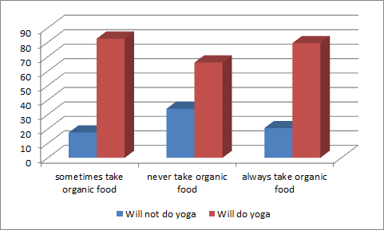

I came across a manuscript which had two charts that looked something like the following charts. Observe the chi-square statistics and the p-values reported in the figure cations below the charts.

(\#fig:unnamed-chunk-1)Relationship between participants' age and their willingness to do yoga (chi-square = 13.59, p-value = 0.009).

(\#fig:unnamed-chunk-2)Relationship between participants' past food consumption behavior and their willingness to do yoga (chi-square = 17.85, p-value = 0.001).

Now observe how they interpreted their results in the quotes below:

> Figure 1 shows that a significantly higher percentage of participants in the 18-25 year age group were willing do yoga than participants in the other age groups (p = 0.005).

> Figure 2 shows that participants who took organic food sometimes had significantly a higher percentage of those who were willing to do yoga than participants who always or never took organic food (p = 0.005).

How many kinds of errors do you see? I discuss the errors and the alternative best practices below.

## How (not) to report p-values

Statisticians recommend that the authors report the exact p-values (using the equality symbol =) rather than reporting the approximate p-values (using the inequality symbol \<), unless they fall below 0.001.
Exact p-values allow readers to double-check the authors' calculations.
However, only the best authors adopt statistical recommendations.

1.  The best authors:

    -   report the exact p-value, rounded to two digits after the decimal, when it is above 0.01;

    -   report the exact p-value, rounded to three digits after the decimal, when it is below 0.01 but above 0.001;

    -   report the approx.
        p-value using the inequality symbol \< only when it falls below 0.001.

2.  Mediocre authors never report the exact p-values. Although they report approximations using the inequality symbol, they round them to the first non-zero-digit observable after the decimal (examples, " we found p-value \< 0.05" or "we found p-value \< 0.001").

3.  Scummy authors only report if a p-value is below or above 0.05, as "we found p-value \< 0.05" or "we found p-value \> 0.05" respectively. (In the life sciences, the number 0.05 is special because a p-value below it is considered significant. "Significant" means it signifies something statistically improbable; "significant" does not mean "important".) In this case, the authors adopted strategy \#1 for their figures and strategy \#2 for the text. Besides being confusing, the mixing of the strategies also caused a mistake. In the text preceding figure 2, they wrote "p = 0.005"; in figure 1 they wrote "p-value = 0.009". But 0.009 is larger than 0.005! Therefore, it is incorrect to have written, "p = 0.005". All of this could be resolved if they reported the exact p-values everywhere and avoided the inequality symbols.

## How (not) to draw charts

The 3D bar charts above have at least three problems:
1. As is clear from their names, the "will do yoga" and "will not do yoga" responses always sum to a 100%. That is the paired red and blue bars always sum to 100% within each age (or organic food) group. Therefore, only one of the responses is needed, the other one is redundant.
2. The gray, shadowed  regions at the top of the bars make it harder to judge their heights. Is the shadowed region included in the height or not?
3. It's best to arrange the bars in order of their height so that you can identify the tallest and shortest bars at a glance. 

Observe how much easier it is to read the 2D versions of the charts above:
<<<<<<< HEAD

